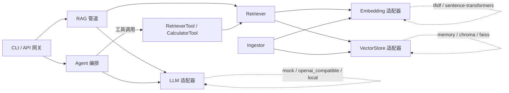

# aether-ai-core（晨星智核）

<p align="center">
  <a href="https://github.com/CJX0712/aether-ai-core-43873e/actions/workflows/ci.yml"></a>
  <a href="https://github.com/CJX0712/aether-ai-core-43873e/releases"></a>
  <a href="https://github.com/CJX0712/aether-ai-core-43873e/blob/master/LICENSE"></a>
  
</p>

> 端到端、模块化、接口驱动的 AI 系统。默认栈零重依赖、无需 GPU 即可一键复现；
> 世界顶级开源后端（sentence-transformers / Chroma / FAISS / vLLM·Ollama / ctransformers）
> 以可选适配器形式即插即用。

**作者：晨星**

> 仓库地址：https://github.com/CJX0712/aether-ai-core-43873e

---

## 核心特性

- **单一职责 + 接口契约**：每个 AI 能力（嵌入 / 向量库 / 大模型 / 检索 / 摄入 / 智能体 / 工具）都是独立模块，定义清晰接口，可单独单元测试，也能编排成完整链路。
- **复用而非自研**：默认栈使用哈希 TF-IDF 嵌入 + 内存向量索引 + 确定性抽取式生成；世界顶级语义/检索/推理能力通过适配器无缝替换。
- **可复现**：锁定依赖（`requirements.lock.txt`）+ Dockerfile + docker-compose + Makefile，干净环境一键拉起。
- **统一入口**：FastAPI 网关 + 命令行，健康检查内置。
- **可观测**：结构化日志贯穿摄入、检索、生成、推理全过程。

## 系统架构



| 层 | 模块 | 职责 | 默认可运行实现 |
|----|------|------|----------------|
| 接口 | `core/interfaces.py` | 定义全部抽象契约 | — |
| 接入 | `adapters/embeddings` | 文本向量化 | `TfidfEmbedding` |
| 接入 | `adapters/vectorstore` | 向量索引与检索 | `MemoryVectorStore` |
| 接入 | `adapters/llm` | 语言模型推理 | `MockLLM` |
| 管道 | `pipeline/ingest` | 文档→切片→嵌入→入库 | `DefaultIngestor` |
| 管道 | `pipeline/retrieval` | 查询→相关切片 | `DefaultRetriever` |
| 管道 | `pipeline/rag` | 检索增强生成 | `RAGPipeline` |
| 智能 | `agent/react_agent` | ReAct 推理与工具调用 | `ReActAgent` |
| 网关 | `api/app.py` + `cli/main.py` | 统一入口 | FastAPI + argparse |

## 快速开始

```bash
# 1. 安装（可复现）
pip install -e .
# 或完整含世界顶级后端与开发工具：
pip install -e ".[dev,world-class]"

# 2. 一键自检（默认栈端到端跑通）
python -m aether eval

# 3. 交互使用
python -m aether ingest --text "晨星是本项目作者。"
python -m aether query --query "谁是作者？"
python -m aether chat --task "计算 (128+64)*3"

# 4. 启动 API 服务
python -m aether serve
# 另开终端：
curl -X POST http://localhost:8000/v1/query -H 'Content-Type: application/json' \
  -d '{"query":"谁是作者？"}'
```

## 切换到世界顶级后端

编辑 `.env`（参考 `.env.example`）或环境变量，无需改动任何业务代码：

```bash
export AETHER_EMBEDDING_BACKEND=sentence_transformer
export AETHER_EMBEDDING_MODEL=BAAI/bge-small-zh-v1.5
export AETHER_VECTORSTORE_BACKEND=chroma
export AETHER_LLM_BACKEND=openai_compatible
export AETHER_LLM_BASE_URL=http://localhost:11434/v1   # 本地 Ollama / vLLM
export AETHER_LLM_MODEL=qwen2.5:7b
```

## 测试与质量

```bash
pytest -q          # 15 个用例，覆盖接口/管道/Agent/API/集成
ruff check src tests
```

## 交付物

- 完整可运行源码（`src/aether/**`）
- 版本锁定依赖（`requirements.lock.txt`）、构建配置（`pyproject.toml` / `Dockerfile` / `Makefile`）
- 文档（`README.md`、`docs/architecture.md`、`docs/deployment.md`、`docs/usage.md`）

许可证：MIT（作者：晨星）
