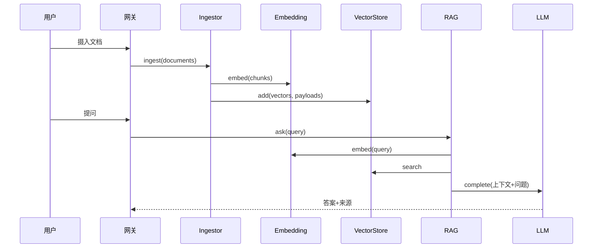

# 架构说明（aether-ai-core）

作者：晨星

本文描述系统的模块边界、接口契约、调用关系与扩展方式。设计目标是：**每个 AI 能力模块可独立验证，又能协同组成完整可运行链路**，且默认栈在干净环境中零外部依赖即可复现。

---

## 1. 分层与依赖方向

依赖只向下流动，上层依赖下层的**接口**而非具体实现：

```
网关层 (api/cli)
   └─> 智能层 (agent) + 管道层 (pipeline)
            └─> 接入层 (adapters) 实现 接口层 (core/interfaces)
```

- `core/interfaces.py`：抽象基类，定义 `EmbeddingModel` / `VectorStore` / `LLMBackend` / `Retriever` / `Ingestor` / `Tool` / `Agent`。
- `core/models.py`：跨模块数据交换的 Pydantic 模型（单一事实来源）。
- `core/config.py` + `core/container.py`：配置加载与依赖注入装配。

## 2. 模块接口契约

### EmbeddingModel
- `dim: int` —— 向量维度。
- `embed(texts) -> list[list[float]]` —— 批量文本编码。

### VectorStore
- `add(ids, vectors, payloads)` —— 写入向量与附属载荷（文本/元数据）。
- `search(query_vector, top_k) -> list[SearchResult]` —— 返回最相似命中（分数越高越相关）。
- `count()` / `clear()`。

### LLMBackend
- `name: str`。
- `complete(messages) -> str` —— 对话消息序列 → 文本补全。

### Retriever / Ingestor / Tool / Agent
- `Retriever.retrieve(query, top_k) -> list[RetrievedChunk]`
- `Ingestor.ingest(documents) -> int`（返回写入切片数）
- `Tool.name` / `Tool.description` / `Tool.run(**kwargs)`
- `Agent.run(task) -> AgentResult`

## 3. 调用关系（数据流）



Agent 路径：`Agent.run` 按 ReAct 循环调用 `Tool`（如 `RetrieverTool` 内部复用 `Retriever`），工具结果回传大模型，直至产出 `Final Answer`。

## 4. 默认可运行栈（确定性、可复现）

| 能力 | 实现 | 说明 |
|------|------|------|
| Embedding | `TfidfEmbedding` | 哈希 TF-IDF + L2 归一化，固定维度，纯 Python，无随机性 |
| VectorStore | `MemoryVectorStore` | numpy 余弦/点积索引，进程内 |
| LLM | `MockLLM` | 抽取式生成，能识别 RAG 与 ReAct 提示，驱动完整链路 |
| 检索 | `DefaultRetriever` | 查询嵌入 → 向量检索 → 切片 |
| 生成 | `RAGPipeline` | 上下文拼接 → 大模型补全 → 可追溯 `GenerationResult` |

## 5. 世界顶级后端（适配器，可选）

缺失依赖时容器给出明确安装提示，不影响基础栈：

| 能力 | 适配器 | 底层技术 |
|------|--------|----------|
| Embedding | `SentenceTransformerEmbedding` | sentence-transformers（BAAI/bge 等） |
| VectorStore | `ChromaVectorStore` | Chroma 持久化向量库 |
| VectorStore | `FaissVectorStore` | FAISS 工业级近邻检索 |
| LLM | `OpenAICompatibleLLM` | vLLM / Ollama / OpenAI 兼容 API |
| LLM | `LocalLLM` | ctransformers 本地 GGUF 模型 |

## 6. 扩展指南

新增一种后端只需：
1. 在 `adapters/<能力>/` 下新建类，继承对应接口；
2. 在 `core/container.py` 的工厂函数中增加分支（惰性导入可选依赖）；
3. （可选）在 `requirements.txt` 注释中给出安装项。

业务代码与配置无需改动即可切换。
